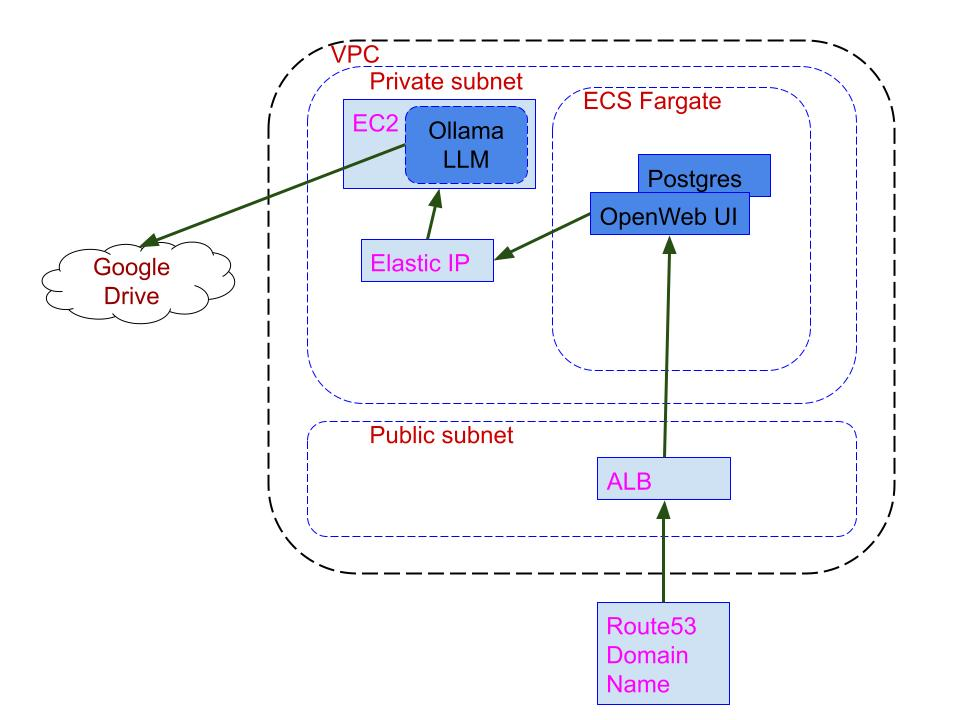

# Project Requirements

## Overview
This project will address several key pain points currently faced by a community orchestra librarian. Managing a large library of sheet music is burdensome due to the varying nature of different music pieces, how they are scored, metadata about the pieces, and how the pieces are broken out into instrument sections.

It can be very time consuming to attempt to collect and categorize the music pieces at the moment of acquisition due to the varying nature of needed sectional components as the orchestra changes over time or modified one-time focus of a specific concert.

## Business Requirements
### Goals
- Provide the ability to query in English across the digital library of music
- Provide method of easily growing of the library by adding additional pieces of sheet music with minimal metadata collection
- Provide assistance with musical score piece research for planning themes of future concerts
- As a future stretch goal, provide the ability to re-score pieces to shift/separate/combine parts for not-included instrument scores, and add them to the library

## Technical Requirements
### Goals
- Provide free open-source AI for research, text generation, and English language interaction
- Provide web interface for easy interaction with AI
- Provide AI access to existing PDF music library
- Provide authentication for access to application
- Provide least cost possible by limiting resources used to minimal when no research is needed
- Provide security around file storage access to protect against copyright infringement 
- Provide IAC for entirety of application

### Stakeholders
- Orchestra Librarian
- Orchestra members
- System Architect
- Software engineer
- DevSecOps engineer

## Functional Requirements
### Core Features
- Domain name to easily access AI application
- Query ability of AI application
- AI with access to digital music library
- AI with web access for research purposes

### User Interface
- There is not much GUI requirements needed.  Only simple questions or queries being asked of the AI, and it responses coming back.  A single text input box with a submit button is enough to cover the basic needs.

### User Experience
- The users will interact with the AI application in the question or query format, and read the responses.  They are technically savvy enough to copy and paste out the responses needed outside this application.  
- If existing files are referenced as part of the query response, the name and folder location are sufficient for inclusion in the response.  Users expect and interact directly with the file storage system outside of this application.
- If new files are created from the AI, it will be creating and pushing the new files into the existing document storage location and simply providing the name folder location of the new file to the user.

## Technical Requirements
### System Architecture
- This application will using off-the-shelf components mounted in the AWS cloud, and communicate via AWS networking.  OLLaMa is an excellent and free open source LLM engine, and OpenWebUI is an excellent GUI for generic LLM querying.  
- 

### Technology Stack
- Frontend:
  - [OpenWebUI](https://docs.openwebui.com/)
- Backend:
  - [Ollama](https://ollama.com/)
- Database:
  - Postgres database embedded with OpenWebUI
- Infrastructure:
  - AWS Cloud
    - VPC
    - 2 Subnets, public and private
    - Elastic IP
    - EC2
    - ECS Fargate, 2 containers
      - OpenWebUI
      - Postgres
    - ALB
    - Route53 Domain name
    - Google drive, pre-existing

### Performance Requirements
- [List performance metrics]
- [Include benchmarks if available]

### Security Requirements
- [List security requirements]
- [Include compliance requirements if applicable]

## Non-Functional Requirements
### Scalability
- [Describe scalability requirements]

### Reliability
- [Describe reliability requirements]

### Maintainability
- [Describe maintainability requirements]

### Compatibility
- [List compatibility requirements]
  - Browsers:
  - Operating Systems:
  - Devices:

## Constraints
- [List any technical, business, or regulatory constraints]

## Dependencies
- [List external dependencies]
- [List internal dependencies]

## Timeline
- [Include project timeline]
- [List major milestones]

## Resources
- [List required resources]
- [Include budget considerations if applicable]

## Risks
- [List potential risks]
- [Include mitigation strategies]

### References
- [List relevant documents]
- [Include links to external resources]

### Change Log
| Date | Version | Description | Author |
|------|---------|-------------|---------| 