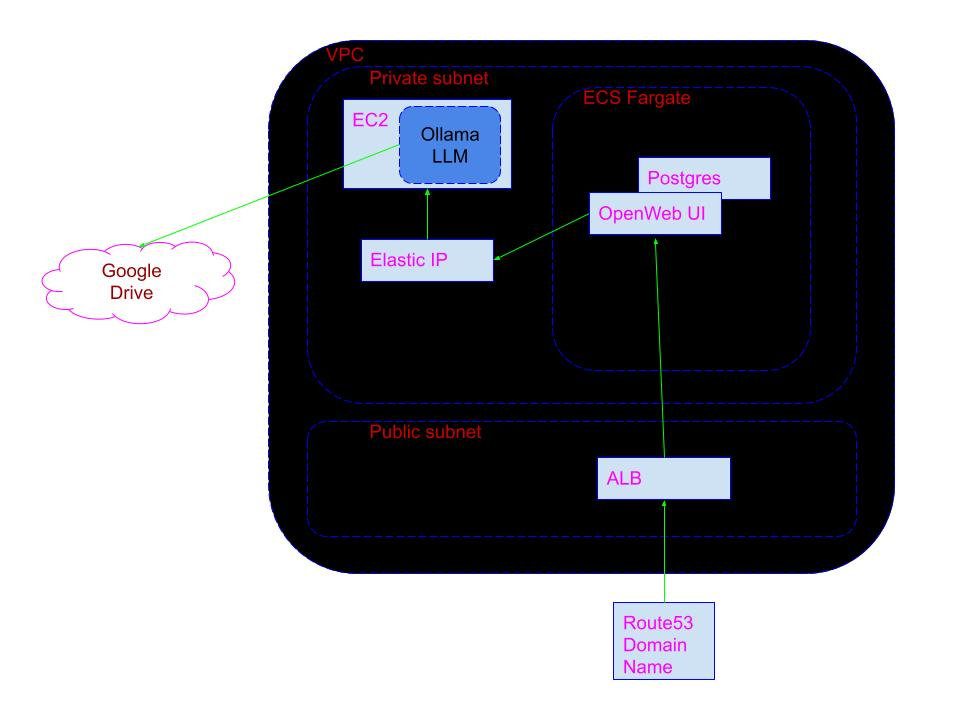

# Phase Infrastructure

## 1. Architecture

### Technology Stack
- Frontend:
  - [OpenWebUI](https://docs.openwebui.com/)
- Backend:
  - [OLLaMa](https://ollama.com/)
- Database:
  - Postgres database embedded with OpenWebUI
- Infrastructure:
  - AWS Cloud
    - VPC
    - 2 Subnets, public and private
    - Elastic IP
    - EC2
    - ECS Fargate, 2 containers
      - OpenWebUI
      - Postgres
    - ALB
    - Route53 Domain name
    - Google drive, pre-existing

### Cost estimates:
There will have to be assumptions made within this section to achieve cost estimates.

#### Assumptions
- Complete shutdown and removal of all deployed components, but some resources will need to remain active/reserved
- Cheapest GPU enhanced EC2 will be sufficient for our purposes.  I will not know if it is sufficient until I have it working and responding on it.

#### Resources used and prices

|Resource|Price|
|----|----|
|vpc| free|
|inbound traffic|free|
|outbound traffic ||
|2 subnets|free|
|multiple SGs|free|
|2 Fargate containers (1024M RAM, 512 vcpu)|??|
|1 EC2, g4ad.xlarge| .37/hr|
|ecs_cluster||
|ecs_task_def||
|ecs_service||
|efs||
|alb||
